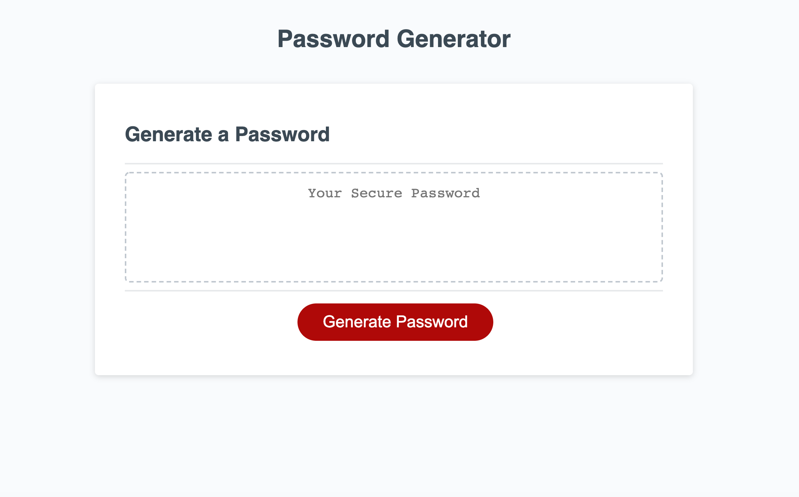
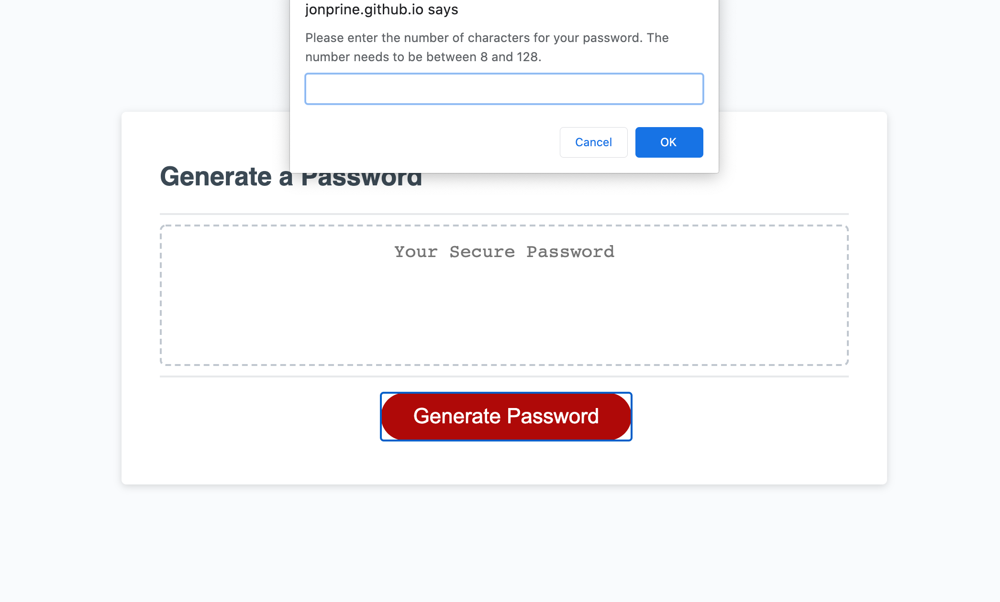
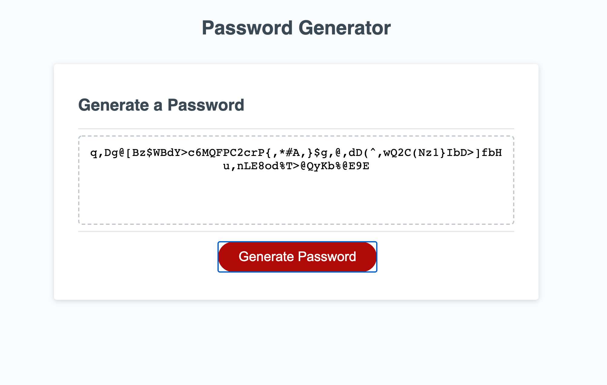

# Random Password Generator

## Purpose
To create a random generate password for a user that can be customized by selecting chararacter length, lowercase, uppercase, and symbols.
The end result should be a unique, secure password.

## Built With
* HTML
* CSS
* Javascript

## Website
https://jonprine.github.io/passwordgen/

## Contribution
Made by [Jon Prine]

## Screenshot
Screenshots of finsihed page

